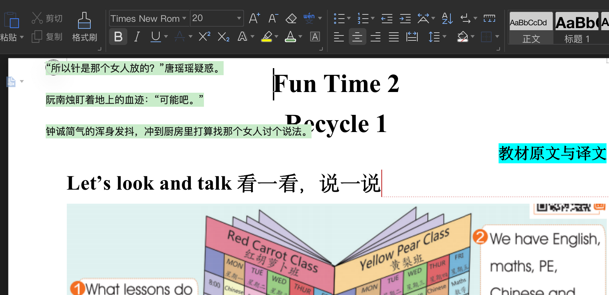

# read-book
- 基于 `electronjs` 开发桌面端无边框 无背景阅读器
- 根据用户上传txt文件，获取完整文件字符串 通过split`第xx章`截取章节
- 用户滚动条到达底部自动加载下一章
- 支持置顶
- 支持`macos` `windows` 多平台

## gif

- 普通模式

- 护眼模式

## 操作说明

- 右键菜单 设置字体 章节

## 项目截图

- 图标

- 视图

